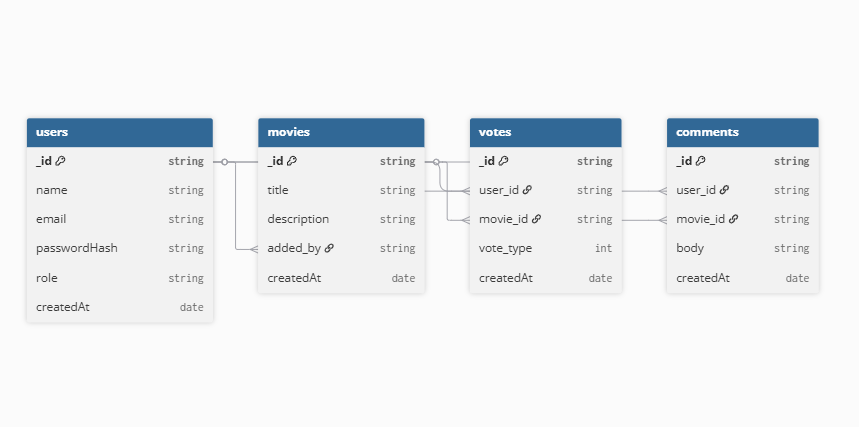

# 🎬 MovieHub – Recommendation Board

A full-stack MERN application where users can:

- Recommend movies 📽️
- Upvote/downvote movies 👍👎
- Comment on movies 💬
- View rankings based on score 🏆
- Admins can moderate movies/comments and view the leaderboard 🔐

---

## 🔑 Sample Credentials (for testing)

To access the **Admin Dashboard**, you can either:

- Change a user’s `role` to `admin` directly in the database, OR
- Use the following test account:

Email: sample123@gmail.com
Password: sample123

---

## 🚀 Tech Stack

- **Frontend**: React, Redux Toolkit Query, Material-UI
- **Backend**: Node.js, Express.js
- **Database**: MongoDB (Mongoose ODM)
- **Authentication**: JWT + Cookies

---

## 🛠️ Features

- **Authentication**: Signup/Login with JWT
- **Movies**: Add, view, delete (admin only)
- **Voting**: Upvote/downvote one movie per user (update allowed)
- **Ranking**: Movies sorted by score (upvotes − downvotes)
- **Comments**: Add, edit, delete your own comments
- **Admin**: Delete movies/comments, view leaderboard

---

## 🖥️ Setup Instructions

### 1. Clone Repo

```bash
git clone https://github.com/your-username/moviehub.git
cd moviehub
```

### 2. Backend Setup

```bash
cd backend
npm install
```

Create a `.env` file:

```env
PORT=5000
MONGO_URI=mongodb://localhost:27017/moviehub
JWT_SECRET=your_jwt_secret
NODE_ENV=development
```

Start backend:

```bash
npm run dev
```

### 3. Frontend Setup

```bash
cd ../frontend
npm install
npm start
```

Frontend runs on **http://localhost:8080**  
Backend runs on **http://localhost:5173**

---

## 🗄️ Database Schema (ERD)

Here’s the entity-relationship diagram for the project:



---

## 📌 API Documentation

### 🔑 Auth

| Method | Endpoint                 | Description                   |
| ------ | ------------------------ | ----------------------------- |
| POST   | `/api/v1/users/register` | Register new user             |
| POST   | `/api/v1/users/login`    | Login user, returns JWT token |
| GET    | `/api/v1/users/logout`   | Logout user (clear cookie)    |
| GET    | `/api/v1/users/me`       | Get your profile              |

---

### 🎬 Movies

| Method | Endpoint             | Description                             |
| ------ | -------------------- | --------------------------------------- |
| POST   | `/api/v1/movies`     | Add a new movie (auth required)         |
| GET    | `/api/v1/movies`     | Get all movies (sorted by score)        |
| GET    | `/api/v1/movies/:id` | Get single movie (with comments, votes) |
| DELETE | `/api/v1/movies/:id` | Delete movie (admin only)               |

---

### 👍 Votes

| Method | Endpoint                 | Description                                                              |
| ------ | ------------------------ | ------------------------------------------------------------------------ |
| POST   | `/api/v1/votes/:movieId` | Upvote or downvote a movie (1 = up, -1 = down). Updates if already voted |

---

### 💬 Comments

| Method | Endpoint                      | Description              |
| ------ | ----------------------------- | ------------------------ |
| POST   | `/api/v1/comments/:movieId`   | Add a comment to a movie |
| PUT    | `/api/v1/comments/:commentId` | Edit your own comment    |
| DELETE | `/api/v1/comments/:commentId` | Delete your own comment  |

---

### 🔐 Admin

| Method | Endpoint                            | Description                              |
| ------ | ----------------------------------- | ---------------------------------------- |
| GET    | `/api/v1/admin/movies/top`          | Get leaderboard of top movies (by score) |
| DELETE | `/api/v1/admin/movies/:movieId`     | Delete a movie + related votes/comments  |
| DELETE | `/api/v1/admin/comments/:commentId` | Delete any comment                       |

---

## 🌍 Deployment

- **Backend**: [Render]
- **Frontend**: [Vercel]
- **Live App**: [https://your-deployed-app.com](https://your-deployed-app.com)

---

### 📦 GitHub Repositories

- **Frontend Repo**: [https://github.com/Imran00852/MovieHub-Client]
- **Backend Repo**: [https://github.com/Imran00852/MovieHub-Server]

## 🤖 AI Usage

AI was **only used for frontend**:

- Getting example React component structures
- Suggesting Material-UI patterns for UI styling

**What I learned:**

- How to adapt AI-generated snippets to fit real data
- How to structure reusable components with MUI
- That using AI speeds up the development process significantly
